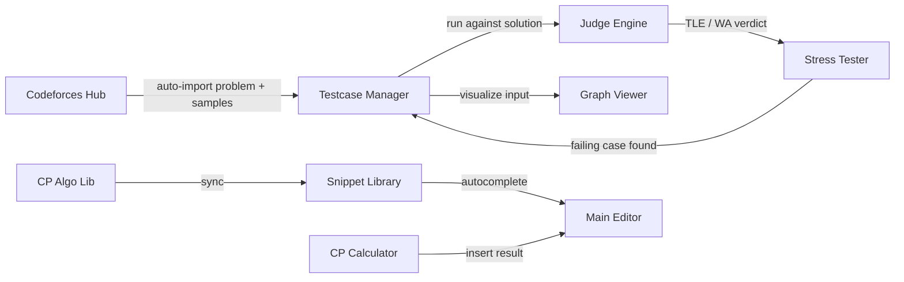

<div align="center">

#  
## ZetaCP

### The competitive programming workspace where every tool actually talks to every other tool.

[](LICENSE)
[](https://tauri.app)
[](https://www.rust-lang.org/)
[](https://react.dev)
[](#-getting-started)

**One editor. One judge. One brain. Zero copy-pasting between tools.**


</div>

---

## 🎯 Why ZetaCP?

Most competitive programmers juggle **five or six disconnected tools** to solve a single problem: an editor, a separate stress-testing script, a folder of `.txt` testcases, a browser tab for Codeforces, a calculator app for combinatorics, and a notes app for scratch work. Every context switch costs time — and in a contest, time is the whole game.

**ZetaCP puts all of it in one app, and — more importantly — makes every piece aware of every other piece.** A failing stress test doesn't just print an error and disappear. It becomes a testcase. A downloaded problem doesn't just save a PDF. It populates your test data and opens your template. Your algorithm library isn't a folder you dig through — it's a snippet away from your cursor.

> **This is the core idea behind ZetaCP: integration is the feature.**

---

## 🔗 The ZetaCP Difference

| Without ZetaCP | With ZetaCP |
|---|---|
| Stress test fails → you manually copy the input/output into a new `.txt` file | Stress test fails → **counter-example is auto-saved to Testcase Manager**, one click to debug |
| Download a CF problem → manually retype sample input/output | Download a CF problem → **samples auto-populate as testcases**, template opens in the editor |
| Need a segment tree → search old submissions or a GitHub gist | Need a segment tree → **CP Algo Lib syncs straight into your snippet autocomplete** |
| Want to visualize a graph input → paste it into a random online tool | Want to visualize a graph input → **Graph Viewer reads the active testcase directly** |
| Get a WA/TLE → guess what input size broke it | Get a WA/TLE → **right-click the verdict → generates new stress tests around that pattern** |

---

## ✨ Features

### 📝 Main Editor
Monaco-powered editor (the same engine behind VS Code) with multi-tab support, LSP server, and instant snippet insertion.

### 🗂️ Explorer
A fast, keyboard-friendly file tree (powered by `react-arborist`) with live file watching — your workspace always reflects disk state in real time.

### 🧩 Snippet Library
Insert boilerplate, templates, or algorithm code in one keystroke. Snippets aren't just static text files — they're a living library.

### 🧪 Testcase Manager
Import, export, and organize testcases per problem. Configure time limit, memory limit, IO mode (File IO/Standard IO) and run mode (sequential/parallel) — the single source of truth every other tool reads from and writes to.

### 🔥 Stress Tester
Pit your solution against a brute force and a generator (including a visual **Blockly**-based generator builder). Runs until it finds a case where outputs diverge — then hands it straight to you.

### 🌐 Codeforces Hub
Log in, browse and download problems, submit directly from the app, or pull a random problem by rating/tag.

### ▶ Problem Fetch
Download testcase and problem statement with competitive companion extension.

### 🧮 Overlay Tools
A floating, always-available toolbelt:
- **CP Calculator** — number theory, combinatorics, bitmask ops, matrix operations, base converter
- **Graph Viewer Pro** — instant graph visualization and analysis
- **File Viewer**, **Text Note**, **Sketchpad** — quick scratch space without leaving the app


### 📚 CP Algo Lib
A curated, built-in algorithm library — data structures, graph algorithms, math, and string algorithms — ready to drop into any solution.

---

## 🏗️ Architecture

ZetaCP is built as a **Tauri v2** desktop app: a React + TypeScript frontend talking to a Rust backend over IPC, with a sandboxed Judge Engine for safely compiling and running untrusted code.



**Stack:** React · TypeScript · Rust · Tauri v2 · Monaco Editor · SQLite

---

## 🚀 Getting Started

```bash
# Clone the repository
git clone https://github.com/your-username/zetacp.git
cd zetacp

# Install frontend dependencies
npm install

# Run in development mode
npm run tauri dev

# Build a production binary
npm run tauri build
```

> Requires Node.js 18+, Rust (stable toolchain), and the Tauri v2 prerequisites for your OS.

---

## 🗺️ Roadmap

- [ ] Cross-platform credential store (Keychain / libsecret alongside DPAPI)
- [ ] Plugin API for third-party Overlay tools
- [ ] Multi-judge support (Codeforces → AtCoder, Codewars)
- [ ] Cloud sync for Snippet Library and Algo Lib
- [ ] Contest mode with countdown + auto-submit queue

---

## 🤝 Contributing

Contributions, bug reports, and feature ideas are welcome! Please open an issue before submitting large PRs so we can discuss the approach first.


### 📞 Connect with Me

* 💬 **Discord:** [Send a Direct Message](https://discord.com/users/906888786888232981) (Feel free to DM me directly for quick questions or feedback).
* ✉️ **Email:** `vythanhnhan369 (at) gmail (dot) com` (Please use this for formal inquiries or security reports).

---

<div align="center">

**Built by competitive programmers, for competitive programmers.**

</div>
